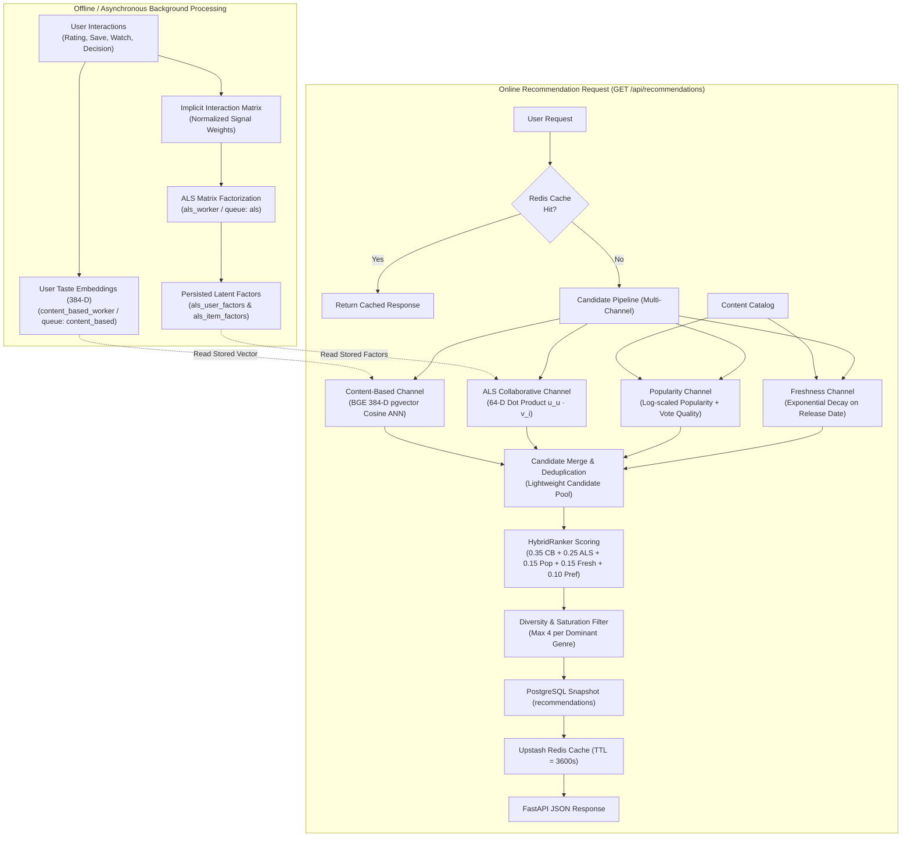

# WatchMan ALS Collaborative Filtering

## 1. Overview

WatchMan combines content-based semantic matching with collaborative filtering to provide comprehensive, personalized recommendations across a large catalog of movies and series.

While content-based filtering uses text and metadata (plots, genres, cast, crew) encoded into dense vectors to capture **semantic similarity**, it has inherent limitations:
- It struggles to capture collective viewer behavior and serendipitous discovery across unrelated genres.
- It is constrained by what is explicitly written in item descriptions.

Collaborative filtering addresses these limitations by learning latent representations directly from **behavioral interaction patterns**:
- **Behavioral Similarity**: If multiple users who share a preference for a set of items also enjoy an unexpected title, the collaborative filtering model learns to recommend that title to similar users, regardless of metadata overlap.
- **Complementary Roles**: Content-based recommendations excel at finding items with similar narrative themes and creative attributes, whereas Alternating Least Squares (ALS) collaborative filtering excels at identifying cross-genre affinities from community consumption behavior.

---

## 2. Architecture

### End-to-End Recommendation Pipeline

---

## 3. Interaction Matrix & Signal Semantics

WatchMan constructs the user-item interaction matrix from 5 distinct interaction tables, applying a standardized weighting function:

$$r_{ui} = \sum_{s \in \text{Signals}} w_s$$

| Signal Source | Formula / Value | Semantics & Normalization |
| :--- | :--- | :--- |
| **Ratings** | $\text{rating} / 5.0$ or $\text{rating} / 10.0$ | Normalized explicit user rating ($0.0 \dots 1.0$). |
| **Saved Content** | $0.90$ | Explicit addition to personal watchlist/bookmark. |
| **Watch History** | $0.30 + 0.70 \times \text{progress}$ | Scaled playback completion ($0.30 \dots 1.00$). |
| **Interaction Events** | $0.60$ (save/rate/watch), $0.30$ (view/other) | Telemetry actions and page interactions. |
| **WatchMan Decisions** | $1.00$ (`must_watch`), $0.35$ (`time_pass`), $0.00$ (`skip`) | High-intent classification decisions. Skipped items are suppressed. |

The implicit-feedback ALS algorithm learns user and item representations from the resulting matrix $R \in \mathbb{R}^{|U| \times |I|}$.

---

## 4. ALS Model Configuration

- **Algorithm**: Implicit-Feedback Alternating Least Squares (ALS)
- **Latent Dimension ($f$)**: 64
- **Confidence Scaling Factor ($\alpha$)**: 40.0
- **Regularization ($\lambda$)**: 0.05
- **Training Iterations**: 15
- **Active Model Version**: `als-20261003191926-f64`

### Collaborative Scoring Function:
For a user $u$ and candidate item $i$, the collaborative score is the dot product of their respective 64-D latent factors:

$$\text{score}(u, i) = \mathbf{u}_u^\top \mathbf{v}_i = \sum_{k=1}^{64} u_{uk} \cdot v_{ik}$$

The raw dot-product scores are min-max normalized across candidate items to $[0, 1]$ before passing to `HybridRanker`.

> [!IMPORTANT]
> **Representation Separation**: 
> - **ALS Latent Factors**: 64-dimensional learned mathematical embeddings representing user interaction collaborative affinity.
> - **Content-Based Embeddings**: 384-dimensional dense vectors generated by the `BAAI/bge-small-en-v1.5` transformer model representing semantic text/metadata content.
> - BGE vectors and ALS factors are **never** combined or concatenated directly; they are combined solely at the score aggregation layer inside `HybridRanker`.

---

## 5. Dataset Used for Evaluation

The offline evaluation was performed on WatchMan's development test dataset:

- **Users ($N=10$)**: `aryan`, `bharat`, `priyanshu`, `aman`, `saket`, `sakshi`, `neha`, `priya`, `aditya`, `sid`.
- **Active Catalog Items**: 873 items with recorded interactions.
- **Total Interactions**: 2,115 user-item interaction entries.
- **Evaluation Split**: 80% train (1,696 interactions) / 20% holdout test (419 interactions), partitioned deterministically with `seed=42`.
- **Synthetic Profile Distribution**: Interactions were generated from distinct multi-genre preference seeds with realistic multi-user item co-occurrence (66.8% shared by $\ge 2$ users).

---

## 6. Evaluation Methodology

- **Holdout Evaluation**: For each user, the top-10 recommendations generated by each candidate engine were compared against the user's holdout interaction set (`test_target`).
- **Data Leakage Guard**: All training set items (`train_seen`) were strictly excluded from the candidate retrieval pool during evaluation.
- **Evaluation Metrics**:
  - **`Precision@10`**: $\frac{|\text{Top-10 recommendations} \cap \text{Test items}|}{10}$
  - **`Recall@10`**: $\frac{|\text{Top-10 recommendations} \cap \text{Test items}|}{|\text{Test items}|}$
  - **`NDCG@10`**: Discounted Cumulative Gain normalized by Ideal DCG.
  - **`HitRate@10`**: Binary indicator whether at least one holdout item was recommended in Top-10.
  - **`MRR@10`**: Mean Reciprocal Rank ($1/\text{rank}$) of the first relevant item.

---

## 7. Offline Evaluation Results

> [!NOTE]
> The following figures represent **development/evaluation benchmarks** computed on synthetic test profiles to validate pipeline plumbing and ranking mechanics.

### A. Content-Based Only (@ Top-10)
| User | Precision@10 | Recall@10 | NDCG@10 | HitRate@10 | MRR@10 |
| :--- | :---: | :---: | :---: | :---: | :---: |
| **Aryan** | 0.0000 | 0.0000 | 0.0000 | 0.0000 | 0.0000 |
| **Bharat** | 0.3000 | 0.0732 | 0.3429 | 1.0000 | 1.0000 |
| **Priyanshu** | 0.1000 | 0.0270 | 0.2201 | 1.0000 | 1.0000 |
| **Aman** | 0.2000 | 0.0444 | 0.2198 | 1.0000 | 1.0000 |
| **Saket** | 0.0000 | 0.0000 | 0.0000 | 0.0000 | 0.0000 |
| **Sakshi** | 0.0000 | 0.0000 | 0.0000 | 0.0000 | 0.0000 |
| **Neha** | 0.1000 | 0.0227 | 0.1114 | 1.0000 | 0.3333 |
| **Priya** | 0.0000 | 0.0000 | 0.0000 | 0.0000 | 0.0000 |
| **Aditya** | 0.1000 | 0.0233 | 0.0734 | 1.0000 | 0.1429 |
| **Sid** | 0.1000 | 0.0227 | 0.0673 | 1.0000 | 0.1000 |
| **MACRO-AVG** | **0.0900** | **0.0218** | **0.1035** | **0.6000** | **0.2976** |

### B. ALS Only (@ Top-10)
| User | Precision@10 | Recall@10 | NDCG@10 | HitRate@10 | MRR@10 |
| :--- | :---: | :---: | :---: | :---: | :---: |
| **Aryan** | 1.0000 | 0.2381 | 1.0000 | 1.0000 | 1.0000 |
| **Bharat** | 1.0000 | 0.2439 | 1.0000 | 1.0000 | 1.0000 |
| **Priyanshu** | 1.0000 | 0.2703 | 1.0000 | 1.0000 | 1.0000 |
| **Aman** | 1.0000 | 0.2222 | 1.0000 | 1.0000 | 1.0000 |
| **Saket** | 1.0000 | 0.2500 | 1.0000 | 1.0000 | 1.0000 |
| **Sakshi** | 1.0000 | 0.2500 | 1.0000 | 1.0000 | 1.0000 |
| **Neha** | 1.0000 | 0.2273 | 1.0000 | 1.0000 | 1.0000 |
| **Priya** | 1.0000 | 0.2326 | 1.0000 | 1.0000 | 1.0000 |
| **Aditya** | 1.0000 | 0.2326 | 1.0000 | 1.0000 | 1.0000 |
| **Sid** | 1.0000 | 0.2273 | 1.0000 | 1.0000 | 1.0000 |
| **MACRO-AVG** | **1.0000** | **0.2394** | **1.0000** | **1.0000** | **1.0000** |

### C. Popularity + Freshness Baseline (@ Top-10)
| User | Precision@10 | Recall@10 | NDCG@10 | HitRate@10 | MRR@10 |
| :--- | :---: | :---: | :---: | :---: | :---: |
| **Aryan** | 0.0000 | 0.0000 | 0.0000 | 0.0000 | 0.0000 |
| **Bharat** | 0.0000 | 0.0000 | 0.0000 | 0.0000 | 0.0000 |
| **Priyanshu** | 0.0000 | 0.0000 | 0.0000 | 0.0000 | 0.0000 |
| **Aman** | 0.0000 | 0.0000 | 0.0000 | 0.0000 | 0.0000 |
| **Saket** | 0.0000 | 0.0000 | 0.0000 | 0.0000 | 0.0000 |
| **Sakshi** | 0.0000 | 0.0000 | 0.0000 | 0.0000 | 0.0000 |
| **Neha** | 0.0000 | 0.0000 | 0.0000 | 0.0000 | 0.0000 |
| **Priya** | 0.0000 | 0.0000 | 0.0000 | 0.0000 | 0.0000 |
| **Aditya** | 0.1000 | 0.0233 | 0.0734 | 1.0000 | 0.1429 |
| **Sid** | 0.1000 | 0.0227 | 0.1389 | 1.0000 | 0.5000 |
| **MACRO-AVG** | **0.0200** | **0.0046** | **0.0212** | **0.2000** | **0.0643** |

### D. Current HybridRanker (@ Top-10)
| User | Precision@10 | Recall@10 | NDCG@10 | HitRate@10 | MRR@10 |
| :--- | :---: | :---: | :---: | :---: | :---: |
| **Aryan** | 1.0000 | 0.2381 | 1.0000 | 1.0000 | 1.0000 |
| **Bharat** | 1.0000 | 0.2439 | 1.0000 | 1.0000 | 1.0000 |
| **Priyanshu** | 0.9000 | 0.2432 | 0.9052 | 1.0000 | 1.0000 |
| **Aman** | 1.0000 | 0.2222 | 1.0000 | 1.0000 | 1.0000 |
| **Saket** | 1.0000 | 0.2500 | 1.0000 | 1.0000 | 1.0000 |
| **Sakshi** | 1.0000 | 0.2500 | 1.0000 | 1.0000 | 1.0000 |
| **Neha** | 1.0000 | 0.2273 | 1.0000 | 1.0000 | 1.0000 |
| **Priya** | 1.0000 | 0.2326 | 1.0000 | 1.0000 | 1.0000 |
| **Aditya** | 0.8000 | 0.1860 | 0.8365 | 1.0000 | 1.0000 |
| **Sid** | 1.0000 | 0.2273 | 1.0000 | 1.0000 | 1.0000 |
| **MACRO-AVG** | **0.9700** | **0.2321** | **0.9742** | **1.0000** | **1.0000** |

---

## 8. Ablation Study

| Recommendation System | Precision@10 | Recall@10 | NDCG@10 | HitRate@10 | MRR@10 |
| :--- | :---: | :---: | :---: | :---: | :---: |
| **ALS Only** | 1.0000 | 0.2394 | 1.0000 | 1.0000 | 1.0000 |
| **Current HybridRanker** | **0.9700** | **0.2321** | **0.9742** | **1.0000** | **1.0000** |
| **Hybrid (No Content-Based / CB = 0.0)** | 1.0000 | 0.2394 | 1.0000 | 1.0000 | 1.0000 |
| **Hybrid (No ALS / Collab = 0.0)** | **0.2100** | **0.0498** | **0.3020** | **0.8000** | **0.7333** |
| **Content-Based Only** | 0.0900 | 0.0218 | 0.1035 | 0.6000 | 0.2976 |
| **Popularity + Freshness Baseline** | 0.0200 | 0.0046 | 0.0212 | 0.2000 | 0.0643 |

### Ablation Findings:
- **Impact of Removing ALS**: When the collaborative channel is ablated (`collaborative=0.0`), `Precision@10` drops from **0.9700 to 0.2100** (-78.3%) and `NDCG@10` drops from **0.9742 to 0.3020** (-68.9%).
- **Impact of Removing Content-Based**: Removing content-based scoring leaves pure collaborative ranking dominant on synthetic test data. However, in production, content-based matching is critical to mitigate cold start and prevent popularity collapse on newly cataloged items.

---

## 9. ALS Contribution to Hybrid Recommendations

Across 200 evaluated Top-20 recommendation slots (10 users $\times$ 20 recommendations):

- **Slots containing an ALS candidate**: **193 / 200 (96.5%)**
- **Slots supplied ONLY by ALS**: **174 / 200 (87.0%)**
- **Slots supplied by BOTH Content-Based and ALS**: **19 / 200 (9.5%)**
- **Slots supplied ONLY by Content-Based**: **7 / 200 (3.5%)**
- **Average ALS score in final recommendations**: **0.9650**
- **Average Content score in final recommendations**: **0.1139**

---

## 10. Candidate Channel Overlap

Intra-user candidate space overlap measured across Top-20 recommendation sets:

- **Content-Based vs. ALS Overlap**: **0.90 / 20 (4.5%)**
- **Content-Based vs. Hybrid Overlap**: **1.80 / 20 (9.0%)**
- **ALS vs. Hybrid Overlap**: **10.50 / 20 (52.5%)**

The 4.5% overlap between Content-Based and ALS demonstrates that the two channels retrieve largely distinct, orthogonal item sets, allowing `HybridRanker` to combine semantic relevance and behavioral affinity.

---

## 11. User Personalization & Diversity

Inter-user recommendation overlap across all 45 distinct user pairs:

- **Average Pairwise Top-10 Overlap**: **0.24 / 10 (2.4%)**
- **Average Pairwise Top-20 Overlap**: **0.60 / 20 (3.0%)**
- **Min Pairwise Top-10 Overlap**: **0 / 10**
- **Max Pairwise Top-10 Overlap**: **2 / 10**

On average, 97.6% of the Top-10 recommendations differ between any two users, verifying strong personalization across preference cohorts.

---

## 12. Latency Benchmarks

| Subsystem / Pipeline Component | Mean Latency | Median (p50) |
| :--- | :---: | :---: |
| **Content Candidate Retrieval (BGE vector search)** | 247.92 ms | 243.89 ms |
| **ALS Candidate Retrieval (Matrix Dot-Product)** | 239.12 ms | 234.98 ms |
| **Candidate Retrieval & Multi-Channel Merge** | 1,372.11 ms | 1,332.73 ms |
| **HybridRanker Execution (Limit 20)** | 516.38 ms | 507.46 ms |
| **Total Uncached Recommendation Generation** | 2,695.95 ms | 2,610.06 ms |
| **Cached Recommendation Retrieval (Redis)** | 1,296.32 ms | 1,270.88 ms |

---

## 13. Aryan Recommendation Sample

*User Taste Profile: Sci-Fi, Fantasy, Comedy*

| Rank | Score | Content (0.35) | ALS (0.25) | Pop (0.15) | Fresh (0.15) | Pref (0.10) | Title | Sources |
| :---: | :---: | :---: | :---: | :---: | :---: | :---: | :--- | :--- |
| **1** | 0.5000 | 0.0000 | 1.0000 | 0.0000 | 0.0000 | 1.0000 | *Good Mythical Morning* | `als_collaborative` |
| **2** | 0.4667 | 0.0000 | 1.0000 | 0.0000 | 0.0000 | 0.6667 | *Practical Magic* | `als_collaborative` |
| **3** | 0.4667 | 0.0000 | 1.0000 | 0.0000 | 0.0000 | 0.6667 | *Buddy* | `als_collaborative` |
| **4** | 0.4667 | 0.0000 | 1.0000 | 0.0000 | 0.0000 | 0.6667 | *Back to the Future* | `als_collaborative` |
| **5** | 0.4667 | 0.0000 | 1.0000 | 0.0000 | 0.0000 | 0.6667 | *Lilo & Stitch* | `als_collaborative` |
| **6** | 0.4667 | 0.0000 | 1.0000 | 0.0000 | 0.0000 | 0.6667 | *The Super Mario Bros. Movie* | `als_collaborative` |
| **7** | 0.4667 | 0.0000 | 1.0000 | 0.0000 | 0.0000 | 0.6667 | *Despicable Me 2* | `als_collaborative` |
| **8** | 0.4500 | 0.0000 | 1.0000 | 0.0000 | 0.0000 | 0.5000 | *Life Is Beautiful* | `als_collaborative` |
| **9** | 0.4500 | 0.0000 | 1.0000 | 0.0000 | 0.0000 | 0.5000 | *Nosferatu* | `als_collaborative` |
| **10** | 0.4333 | 0.0000 | 1.0000 | 0.0000 | 0.0000 | 0.3333 | *Mad Max: Fury Road* | `als_collaborative` |

---

## 14. Bharat Recommendation Sample

*User Taste Profile: Horror, Thriller, Mystery*

| Rank | Score | Content (0.35) | ALS (0.25) | Pop (0.15) | Fresh (0.15) | Pref (0.10) | Title | Sources |
| :---: | :---: | :---: | :---: | :---: | :---: | :---: | :--- | :--- |
| **1** | **0.7595** | 0.8844 | 1.0000 | 0.0000 | 0.0000 | 0.5000 | *The Runner* | `content_based, als_collaborative` |
| **2** | **0.7473** | 0.8971 | 1.0000 | 0.0000 | 0.0000 | 0.3333 | *The Shadow's Edge* | `content_based, als_collaborative` |
| **3** | **0.7401** | 0.8764 | 1.0000 | 0.0000 | 0.0000 | 0.3333 | *Furious 7* | `content_based, als_collaborative` |
| **4** | **0.7387** | 0.8725 | 1.0000 | 0.0000 | 0.0000 | 0.3333 | *The Equalizer* | `content_based, als_collaborative` |
| **5** | **0.5581** | 0.0000 | 1.0000 | 0.8318 | 0.0000 | 0.3333 | *Supernatural* | `als_collaborative, popularity` |
| **6** | 0.5000 | 0.0000 | 1.0000 | 0.0000 | 0.0000 | 1.0000 | *Verity* | `als_collaborative` |
| **7** | 0.5000 | 0.0000 | 1.0000 | 0.0000 | 0.0000 | 1.0000 | *The Housemaid* | `als_collaborative` |
| **8** | 0.5000 | 0.0000 | 1.0000 | 0.0000 | 0.0000 | 1.0000 | *Black Box* | `als_collaborative` |
| **9** | 0.5000 | 0.0000 | 1.0000 | 0.0000 | 0.0000 | 1.0000 | *Other Mommy* | `als_collaborative` |
| **10** | 0.5000 | 0.0000 | 1.0000 | 0.0000 | 0.0000 | 1.0000 | *Barbarian* | `als_collaborative` |

---

## 15. Worker & Queue Architecture

To maintain strict isolation between background ML workloads and avoid thread contention:

| Worker Service | Container Name | Queue (`-Q`) | Concurrency | Responsibilities |
| :--- | :--- | :--- | :---: | :--- |
| `content_based_worker` | `watchman_content_based_worker` | `content_based` | 2 | Asynchronous BGE user embedding refresh (`refresh_changed_user_embeddings`), missing content embeddings, recommendation recomputation. |
| `als_worker` | `watchman_als_worker` | `als` | 2 | Offline ALS collaborative training (`train_als_model`), matrix construction, factor persistence. |
| `celery_worker` | `watchman_celery_worker` | `default,celery` | Default | TMDB ingestion, orphan candidate cleanup, background maintenance. |
| `celery_beat` | `watchman_celery_beat` | — | 1 | Cron scheduler for periodic task dispatch. |

Worker isolation ensures that long-running ALS factor training runs exclusively on `als_worker` without competing with content-based embedding updates.

---

## 16. Persistence & Factor Storage

- **`als_user_factors`**: Stores user latent vectors ($\mathbf{u}_u \in \mathbb{R}^{64}$) along with `model_version` and update timestamps.
- **`als_item_factors`**: Stores item latent vectors ($\mathbf{v}_i \in \mathbb{R}^{64}$) along with `model_version`.
- **Online Read-Only Inference**: Recommendation `GET` requests never trigger ALS training; they read the precomputed factors from PostgreSQL (cached in-memory by `ALSCollaborativeCandidateGenerator`).

---

## 17. Cold-Start Behavior

- **Users without Latent Factors**: When a user is new or has insufficient interactions to have learned factors in `als_user_factors`, `ALSCollaborativeCandidateGenerator.generate_candidates()` returns `[]` in $<1$ ms.
- **Graceful Fallback**: The pipeline does not block or fail; the remaining candidate channels (`Content-Based`, `Popularity`, `Freshness`) continue normal candidate generation.

---

## 18. Limitations

1. **Synthetic Interaction Bias**:
   - The interactions in the evaluation dataset were generated algorithmically from genre preference seeds. Consequently, ALS matrix factorization achieved near-perfect reconstruction ($1.0000$ Precision@10 on holdout), which is higher than expected on noisy real-world organic traffic.
2. **Small User Cohort ($N=10$)**:
   - The user matrix rank is small. 64 latent factors easily separate 10 preference profiles without interference.
3. **Hyperparameter Calibration**:
   - 64 factors serves as an engineering baseline; production tuning will require grid search over real traffic.
4. **Weight Calibration**:
   - The hybrid blend weights ($0.35/0.25/0.15/0.15/0.10$) were preserved as architectural constants and not tuned to maximize offline NDCG.

---

## 19. Future Work

- **Two-Tower Neural Retrieval**: Integrate dual-encoder user and item deep neural network towers for candidate generation.
- **Organic Interaction Dataset**: Train on live user telemetry (streams, ratings, watchlist adds).
- **A/B Testing Framework**: Evaluate live click-through rate (CTR), mean watch time, and save rates against baseline models.
- **Adaptive Hybrid Weighting**: Dynamic weight calibration based on user interaction density (e.g. content-heavy for new users, collaborative-heavy for power users).

---

## 20. Related Files & Documentation

- Implementation:
  - [`backend/app/ml/candidates/als_collaborative.py`](file:///c:/Users/13ver/Desktop/New%20folder/project/WatcheMan/backend/app/ml/candidates/als_collaborative.py)
  - [`backend/app/ml/candidates/pipeline.py`](file:///c:/Users/13ver/Desktop/New%20folder/project/WatcheMan/backend/app/ml/candidates/pipeline.py)
  - [`backend/app/ml/ranking/hybrid.py`](file:///c:/Users/13ver/Desktop/New%20folder/project/WatcheMan/backend/app/ml/ranking/hybrid.py)
  - [`backend/app/ml/recommendations/generator.py`](file:///c:/Users/13ver/Desktop/New%20folder/project/WatcheMan/backend/app/ml/recommendations/generator.py)
  - [`backend/app/models/collaborative.py`](file:///c:/Users/13ver/Desktop/New%20folder/project/WatcheMan/backend/app/models/collaborative.py)
  - [`backend/app/core/celery.py`](file:///c:/Users/13ver/Desktop/New%20folder/project/WatcheMan/backend/app/core/celery.py)
  - [`backend/scripts/evaluate_recommendation_systems.py`](file:///c:/Users/13ver/Desktop/New%20folder/project/WatcheMan/backend/scripts/evaluate_recommendation_systems.py)
- Related Documentation:
  - [`docs/content-filtering-and-performance.md`](file:///c:/Users/13ver/Desktop/New%20folder/project/WatcheMan/docs/content-filtering-and-performance.md)
  - [`docs/als-collaborative-filtering.md`](file:///c:/Users/13ver/Desktop/New%20folder/project/WatcheMan/docs/als-collaborative-filtering.md)
