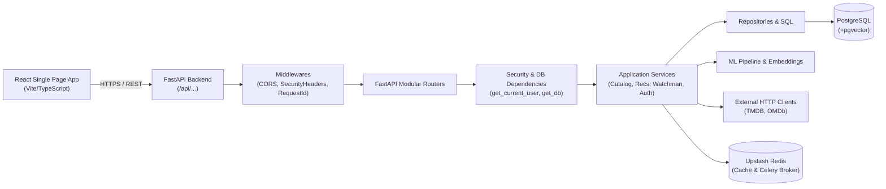

# WatchMan - REST API Design & Reference

## 1. API Architecture

WatchMan exposes a high-performance asynchronous REST API built with FastAPI.



---

## 2. Authentication & Security Flow

WatchMan implements stateless JSON Web Token (JWT) authentication directly inside FastAPI:

```
[ User Registers or Logs In ]
           │
           ▼
FastAPI issues signed HS256 JWT Access Token & Refresh Token
Payload: `sub` (user UUID), `exp` (expiration), `type` ("access" | "refresh")
           │
           ▼
Frontend stores tokens & attaches header: `Authorization: Bearer <access_token>`
           │
           ▼
FastAPI `get_current_user` Dependency:
  1. Validates JWT signature and expiry using SECRET_KEY.
  2. Extracts user UUID string from JWT `sub` claim.
  3. Loads active User entity from PostgreSQL `users` table.
```

---

## 3. API Endpoints by Domain

### A. Authentication API (`/api/auth`)

| Method | URL | Auth Required | Description |
| :--- | :--- | :---: | :--- |
| `POST` | `/api/auth/register` | No | Register a new user account with email, password, username, and full name. Initializes default profile and user preference records. |
| `POST` | `/api/auth/login` | No | Authenticate user with email and password; returns access and refresh JWT tokens. |
| `POST` | `/api/auth/refresh` | No | Validate refresh token and issue a fresh access token and rotated refresh token. |
| `GET` | `/api/auth/me` | Yes | Retrieve profile details of currently authenticated user. |
| `POST` | `/api/auth/logout` | No | Acknowledge stateless logout. |
| `GET` | `/api/auth/health` | No | Liveness probe for auth subsystem. |

#### Example: `POST /api/auth/login`
- **Request Body**:
  ```json
  {
    "email": "user@example.com",
    "password": "SecurePassword123"
  }
  ```
- **Response Shape (200 OK)**:
  ```json
  {
    "access_token": "eyJhbGciOiJIUzI1Ni...",
    "refresh_token": "eyJhbGciOiJIUzI1Ni...",
    "token_type": "bearer",
    "user": {
      "id": "f2133dda-219c-40ea-9187-fbdab5a75a2b",
      "email": "user@example.com",
      "full_name": "John Doe",
      "username": "johndoe",
      "avatar_url": null,
      "is_active": true,
      "created_at": "2026-10-01T12:00:00Z",
      "updated_at": "2026-10-01T12:00:00Z"
    }
  }
  ```

---

### B. Content & Catalog API

#### Movies API (`/api/movies`)
| Method | URL | Auth Required | Description |
| :--- | :--- | :---: | :--- |
| `GET` | `/api/movies` | No | List movies stored in PostgreSQL with filtering (`year`, `genre_id`, `language`, `collection=popular`), sorting (`sort`), and pagination (`page`, `limit`). |
| `POST` | `/api/movies/sync` | Yes | Ingest and synchronize a single movie from TMDB by `movie_id` into PostgreSQL. |
| `GET` | `/api/movies/trending` | No | Normalized trending movies showcase for the week from TMDB. |
| `GET` | `/api/movies/top-10` | No | Top 10 movies for homepage landing rail. |
| `GET` | `/api/movies/popular` | No | Popular movies grid page. |
| `GET` | `/api/movies/top-rated` | No | Top-rated movies grid page. |
| `GET` | `/api/movies/latest` | No | Latest / now-playing movies grid page. |
| `GET` | `/api/movies/search` | No | Search movies via TMDB (returns empty array if no matches). |
| `GET` | `/api/movies/{movie_id}` | No | Get movie details, cast, crew, genres, languages, videos, external IDs, and enriched OMDb ratings (IMDb, Rotten Tomatoes, Metacritic). |
| `GET` | `/api/movies/{movie_id}/similar` | No | Item-to-item similar movies via `pgvector` embedding cosine similarity, falling back to TMDB. |
| `GET` | `/api/movies/{movie_id}/watch-providers` | No | Streaming availability in region (e.g. `region=IN`). |
| `GET` | `/api/movies/{movie_id}/images` | No | Backdrop and poster image gallery. |
| `GET` | `/api/movies/{movie_id}/tmdb-reviews` | No | External community reviews from TMDB. |

#### Web Series API (`/api/web-series`)
| Method | URL | Auth Required | Description |
| :--- | :--- | :---: | :--- |
| `GET` | `/api/web-series` | No | List web series / TV shows with filtering (`year`, `genre_id`, `language`, `collection=popular`), sorting, and pagination. |
| `POST` | `/api/web-series/sync` | Yes | Ingest/sync a TV show by `tv_id` from TMDB into PostgreSQL. |
| `GET` | `/api/web-series/trending` | No | Normalized trending TV shows for the week. |
| `GET` | `/api/web-series/top-10` | No | Top 10 web series for homepage landing rail. |
| `GET` | `/api/web-series/popular` | No | Popular TV shows grid page. |
| `GET` | `/api/web-series/top-rated` | No | Top-rated TV shows grid page. |
| `GET` | `/api/web-series/latest` | No | Latest / on-the-air TV shows grid page. |
| `GET` | `/api/web-series/search` | No | Search TV shows via TMDB. |
| `GET` | `/api/web-series/{tv_id}` | No | Full series details, season/episode counts, cast, crew, external IDs, and OMDb ratings. |
| `GET` | `/api/web-series/{tv_id}/similar` | No | Similar TV shows from TMDB. |
| `GET` | `/api/web-series/{tv_id}/watch-providers`| No | Regional streaming provider availability. |
| `GET` | `/api/web-series/{tv_id}/images` | No | Series backdrops and posters. |
| `GET` | `/api/web-series/{tv_id}/tmdb-reviews` | No | Community reviews from TMDB. |

---

### C. Search & Trending API

#### Unified Search API (`/api/search`)
| Method | URL | Auth Required | Description |
| :--- | :--- | :---: | :--- |
| `GET` | `/api/search` | No | Universal multi-type search across movies and web series (`type=all|movie|tv`, `genre_id`, `language`, `year`, `sort`, `page`, `limit`). Searches local database with automatic fallback to TMDB multi-search when local results are empty. |
| `GET` | `/api/search/movies` | No | Movie search backward-compatibility route. |
| `GET` | `/api/search/tv` | No | Web series search backward-compatibility route. |

#### Global Trending API (`/api/trending`)
| Method | URL | Auth Required | Description |
| :--- | :--- | :---: | :--- |
| `GET` | `/api/trending` | No | Combined trending movies and TV shows showcase for time window (`time_window=day|week`). |
| `GET` | `/api/trending/{content_type}/{tmdb_id}` | No | Fetch details for a specific trending item. |

---

### D. OTT / Streaming Discovery API (`/api/ott`)

| Method | URL | Auth Required | Description |
| :--- | :--- | :---: | :--- |
| `GET` | `/api/ott/regions` | No | List ISO-3166-1 regions supported for watch-provider data. |
| `GET` | `/api/ott/providers` | No | List streaming services available in a region (`region=IN`, `content_type=movie|tv`) ordered by local display priority. |
| `GET` | `/api/ott/{content_type}` | No | Discover titles available on a specific provider within a region (`provider_id`, `region`, `sort_by`, `page`). |

---

### E. Recommendation API (`/api/recommendations`)

| Method | URL | Auth Required | Description |
| :--- | :--- | :---: | :--- |
| `GET` | `/api/recommendations` | Yes | Get personalized hybrid recommendations for the user (`limit`, `page`, `content_type=all|movie|tv`, `force_refresh`). Serves from Redis cache or persists a fresh snapshot. |
| `POST` | `/api/recommendations/refresh` | Yes | Invalidate Redis cache keys (`recommendations:user:<id>:*`) and trigger on-demand recomputation. |
| `GET` | `/api/recommendations/personalized` | Yes | Live candidate generation blend from content, peer activity, and popularity. |
| `GET` | `/api/recommendations/home` | Yes | Unified homepage shelves payload returning *You Must Like*, *You Already Watched & Liked*, and *Continue Watching*. |
| `GET` | `/api/recommendations/must-like` | Yes | Shelf of highest-confidence hybrid recommendations. |
| `GET` | `/api/recommendations/watched-liked` | Yes | Shelf of rediscovery items based on completed, highly rated titles. |
| `GET` | `/api/recommendations/continue-watching`| Yes | Shelf representing real in-progress playback ($0.01 \le \text{progress} < 1.0$). |
| `GET` | `/api/recommendations/{content_type}/{tmdb_id}` | No | Dense vector embedding similarity for a specific content item. |

---

### F. User Interactions & Feedback API

#### Saved Content / Watchlist (`/api/saved` & `/api/favorites`)
| Method | URL | Auth Required | Description |
| :--- | :--- | :---: | :--- |
| `GET` | `/api/saved` | Yes | Retrieve all saved watchlist items for the authenticated user. |
| `GET` | `/api/saved/paginated` | Yes | Paginated list of saved watchlist items (`page`, `limit`). |
| `POST` | `/api/saved` | Yes | Add a movie or TV show to saved items (`content_id`, `tmdb_id`, `content_type`). |
| `DELETE`| `/api/saved/{content_type}/{tmdb_id}` | Yes | Remove item from saved watchlist by content type and TMDB ID. |
| `DELETE`| `/api/saved/{content_id}` | Yes | Remove item from saved watchlist by internal database ID. |

#### Ratings API (`/api/ratings`)
| Method | URL | Auth Required | Description |
| :--- | :--- | :---: | :--- |
| `GET` | `/api/ratings` | Yes | Retrieve all ratings submitted by the authenticated user. |
| `GET` | `/api/ratings/paginated` | Yes | Paginated ratings submitted by user (`page`, `limit`). |
| `GET` | `/api/ratings/{content_type}/{tmdb_id}`| Yes | Get user's rating for a specific title. |
| `POST` | `/api/ratings` | Yes | Create or update a star rating ($1.0 \dots 10.0$) and optional review. |
| `PUT` | `/api/ratings/{content_type}/{tmdb_id}`| Yes | Upsert rating by TMDB ID. |
| `PUT` | `/api/ratings/{movie_id}` | Yes | Upsert rating by internal ID. |
| `DELETE`| `/api/ratings/{content_type}/{tmdb_id}`| Yes | Delete rating by TMDB ID. |
| `DELETE`| `/api/ratings/{movie_id}` | Yes | Delete rating by internal ID. |

#### Watch History API (`/api/watch-history`)
| Method | URL | Auth Required | Description |
| :--- | :--- | :---: | :--- |
| `GET` | `/api/watch-history` | Yes | Retrieve all watch history records for the user. |
| `GET` | `/api/watch-history/paginated` | Yes | Paginated watch history records (`page`, `limit`). |
| `POST` | `/api/watch-history` | Yes | Log playback progress (`progress` $0.0 \dots 1.0$, `completed` boolean). |
| `PUT` | `/api/watch-history/{history_id}` | Yes | Update progress on existing history record (enforces ownership). |
| `DELETE`| `/api/watch-history/{history_id}` | Yes | Delete a watch history record (enforces ownership). |

#### WatchMan Decision & Scoring API (`/api/content` / `/api/movies` / `/api/web-series`)
| Method | URL | Auth Required | Description |
| :--- | :--- | :---: | :--- |
| `GET` | `/api/content/{content_id}/watchman` | Optional | Compute dynamic WatchMan score ($0 \dots 100$), classification badge (*Must Watch*, *Time Pass*, *Skip*), community breakdown, and active user decision. |
| `PUT` | `/api/content/{content_id}/watchman` | Yes | Persist user decision (`decision`: `must_watch` \| `time_pass` \| `skip`) and return recalculated score. |

#### Community Reviews API (`/api/reviews`)
| Method | URL | Auth Required | Description |
| :--- | :--- | :---: | :--- |
| `GET` | `/api/reviews/{content_type}/{tmdb_id}`| No | Paginated public community reviews for a content item. |
| `POST` | `/api/reviews` | Yes | Publish a written review with title and star rating. |
| `PUT` | `/api/reviews/{review_id}` | Yes | Edit an existing review (must be the review author). |
| `DELETE`| `/api/reviews/{review_id}` | Yes | Delete a review (must be the review author). |

#### Users & Preferences API (`/api/users`)
| Method | URL | Auth Required | Description |
| :--- | :--- | :---: | :--- |
| `GET` | `/api/users/me/profile` | Yes | Retrieve the user's public profile data. |
| `PUT` | `/api/users/me/profile` | Yes | Update user profile details (full name, username, avatar URL). |
| `GET` | `/api/users/me/preferences` | Yes | Retrieve user's explicit genre preferences (`favorite_genres`, `disliked_genres`). |
| `PUT` | `/api/users/me/preferences` | Yes | Update genre preferences with strict taxonomy validation against the `genres` table. |

---

### G. System Operations & Admin APIs

#### Health & Readiness Probes
| Method | URL | Auth Required | Description |
| :--- | :--- | :---: | :--- |
| `GET` | `/health` & `/api/health` | No | Liveness probe indicating backend process is alive. |
| `GET` | `/ready` & `/api/ready` | No | Readiness probe verifying PostgreSQL and Upstash Redis connectivity. |

#### Operations & Telemetry (`/api/ops`)
| Method | URL | Auth Required | Description |
| :--- | :--- | :---: | :--- |
| `GET` | `/api/ops/metrics` | Operator Only | Rolling telemetry metrics, latency percentiles (p50, p95, p99), status code distributions, and route breakdowns. |
| `GET` | `/api/ops/status` | Operator Only | Infrastructure diagnostics (DB pool size, Redis memory, disk usage, python version). |

#### ML Embeddings Admin (`/api/ml/embeddings`)
| Method | URL | Auth Required | Description |
| :--- | :--- | :---: | :--- |
| `POST` | `/api/ml/embeddings/movies/batch` | Operator Only | Trigger batch BGE embedding generation for missing movie records. |
| `POST` | `/api/ml/embeddings/movies/{movie_id}`| Operator Only | Compute embedding for a single movie. |

---

## 4. Standard Error Response Format

WatchMan uses a structured, consistent JSON error schema across all endpoints:

```json
{
  "success": false,
  "error": {
    "code": "NOT_FOUND",
    "message": "Content with identifier '99999' was not found.",
    "details": null
  }
}
```

### Common Error Codes:
- `VALIDATION_ERROR` (422): Request schema or parameter validation failure.
- `UNAUTHORIZED` (401): Missing or expired JWT authentication token.
- `FORBIDDEN` (403): User lacks permissions for requested resource or operation.
- `NOT_FOUND` (404): Requested entity does not exist.
- `RESOURCE_CONFLICT` (409): Duplicate email or resource collision.
- `INTERNAL_SERVER_ERROR` (500): Unhandled exception. Returns an opaque `request_id` for log correlation.

---

## 5. Performance & Caching Architecture

1. **Redis Cache (1-Hour Recommendation TTL)**:
   - `GET /api/recommendations` checks key `recommendations:user:<uuid>:limit:<N>:page:<P>`.
   - On a hit, response is returned in $<15$ ms without querying PostgreSQL or invoking candidate generators.
2. **PostgreSQL Snapshots (`recommendations` Table)**:
   - When computed, recommendation candidates are stored in the database, ensuring fast pagination across pages.
3. **Background ML Offloading**:
   - Time-intensive computations (BGE user centroid calculation and ALS matrix factorization) are executed asynchronously in dedicated Celery workers.
   - HTTP request handlers **never** calculate embeddings or train collaborative models synchronously.
