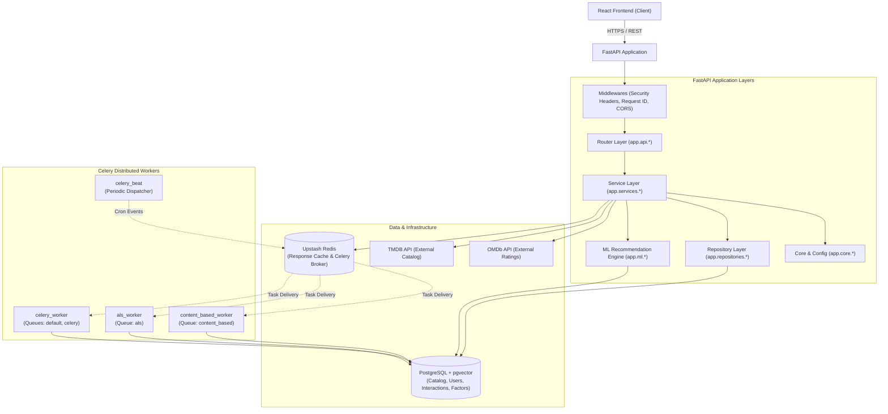
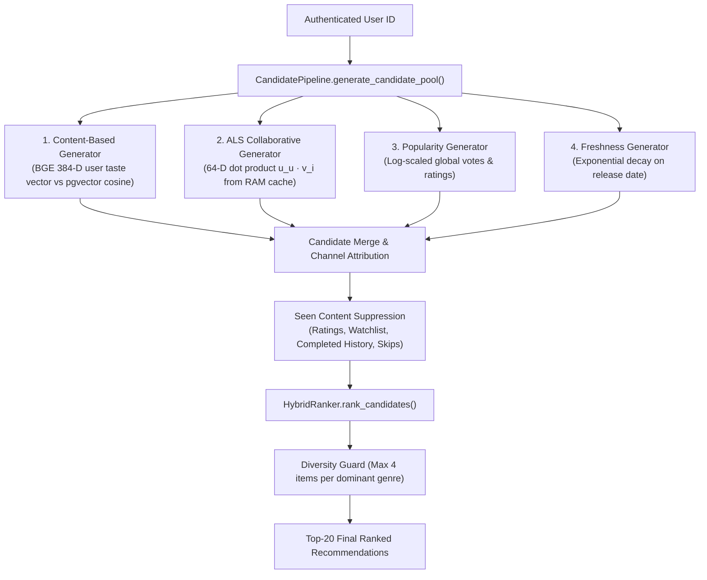

# WatchMan - Backend Architecture & System Design

## 1. High-Level Backend Architecture

WatchMan's backend is architected as an asynchronous, layered Python application using FastAPI, PostgreSQL (with pgvector), Upstash Redis, and an isolated Celery background worker cluster:



---

## 2. FastAPI Application Layers

The backend codebase (`backend/app/`) follows strict separation of concerns across 7 distinct architectural layers:

```
backend/app/
├── api/              # 1. API / Router Layer: HTTP routing, parameter parsing, and response serialization
├── services/         # 2. Service Layer: Orchestration of domain logic, external clients, and transactions
├── repositories/     # 3. Repository Layer: Explicit SQL queries, relationship joins, and data access
├── models/           # 4. Model Layer: SQLAlchemy ORM entities, schema constraints, and foreign keys
├── ml/               # 5. ML Layer: Candidate generators, ALS training, BGE vector embeddings, HybridRanker
├── tasks/            # 6. Task / Worker Layer: Celery task implementations and async worker jobs
├── core/             # 7. Core & Config Layer: Settings, JWT security, Redis client, telemetry, logger
├── db/               # Database engine, session factories, and base declarative class
├── schemas/          # Pydantic validation schemas for domain entities and DTOs
└── middleware/       # Custom ASGI middlewares (request tracing and security headers)
```

### Layer Responsibilities
1. **API / Router Layer (`app.api.*`)**:
   - Declares endpoints, path/query parameter validation, HTTP status codes, and dependency injection (`Depends(get_current_user)`, `Depends(get_db)`).
2. **Service Layer (`app.services.*`)**:
   - `ContentCatalogService`: Catalog querying, genre/language filtering, and detail enrichment.
   - `RecommendationService`: Multi-shelf orchestration, Redis caching, and cache invalidation.
   - `WatchmanService`: Dynamic 0–100 score calculation and community feedback aggregation.
   - `TMDBService` & `OMDBService`: Resilient HTTP client integrations with retry and fallback mechanics.
3. **Repository Layer (`app.repositories.*`)**:
   - `ContentRepository`: Fine-grained SQL access with explicit relationship loading (`joinedload` / `selectinload`), eliminating N+1 query overhead.
4. **Model Layer (`app.models.*`)**:
   - Declares all 18 PostgreSQL tables using SQLAlchemy 2.0 mapped columns.
5. **ML Layer (`app.ml.*`)**:
   - `CandidatePipeline`: Parallel candidate generation across Content, ALS, Popularity, and Freshness.
   - `HybridRanker`: Multi-objective weighted score blending and genre saturation filtering.
   - `ALSCollaborativeCandidateGenerator`: Online dot-product factor evaluation.
   - `ALSTrainer`: Offline sparse interaction matrix factorization.
6. **Task / Worker Layer (`app.tasks.*`)**:
   - Celery async tasks (`embeddings.py`, `collaborative.py`, `recommendation.py`, `fetch_tmdb.py`, `cleanup.py`).
7. **Core / Config Layer (`app.core.*`)**:
   - Pydantic Settings (`settings`), security utilities, non-blocking Redis wrapper, timing telemetry.

---

## 3. Database Architecture (PostgreSQL + pgvector)

PostgreSQL (hosted on Supabase) serves as the primary system of record for all structured data:
- **Catalog Data**: Normalized movie and TV metadata across `contents`, `genres`, `content_genres`, `languages`, `content_languages`, `people`, `content_cast`, `content_crew`, `content_videos`, and `content_external_ids`.
- **User & Profile Data**: `users`, `profiles`, and `user_preferences`.
- **Interaction Data**: `ratings`, `saved_content`, `watch_history`, `interaction_events`, `watchman_decisions`, `reviews`, and `search_history`.
- **Vector Representations**: `content_embeddings` and `user_embeddings` storing 384-D BGE dense vectors in native `pgvector` columns (`Vector(384)`).
- **Collaborative Latent Factors**: `als_user_factors` and `als_item_factors` storing 64-D JSON float arrays.
- **Snapshot Persistence**: `recommendations` table persisting deterministic top-N output per user.

---

## 4. Redis Architecture & Caching Strategy

Upstash Redis is utilized across two distinct subsystems:

### 1. Celery Message Broker & Result Backend
- Routes background task messages across the 3 queues (`default`, `content_based`, `als`).
- Uses TLS connection (`rediss://`) with `ssl_cert_reqs=ssl.CERT_REQUIRED`.

### 2. Response Cache Layer (`app.core.redis.RedisCache`)
- **Key Namespaces**:
  - `recommendations:user:<uuid>:limit:<N>:page:<P>`: Full JSON recommendation payload (TTL = 3600 seconds).
  - `omdb:ratings:<imdb_id>`: External critic rating JSON payload (TTL = 86400 seconds).
- **Graceful Degradation**: If Redis is unreachable or times out (2.0s connect/read timeout), `RedisCache` catches the error, logs a warning, and degrades gracefully to direct PostgreSQL execution without failing HTTP requests.
- **Selective Invalidation**: When user interactions occur, `RecommendationService.invalidate_user_cache(user_id)` purges matching keys using `delete_pattern("recommendations:user:<user_id>:*")`.

---

## 5. Dedicated In-Memory Caching (Process-Local)

> [!IMPORTANT]
> **Distinction Between Redis and In-Memory Caches**:
> - **Redis Cache**: Distributed, shared across all backend processes, survives application restarts, and requires network serialization.
> - **In-Memory Process Cache**: Stored directly in the Python interpreter's RAM inside the active process. It requires 0 ms network overhead, but is process-isolated and cleared upon container restart.

### Item Factor Matrix Cache (`ALSCollaborativeCandidateGenerator._ITEM_CACHE`)
- **What is Cached**: The complete 2D NumPy array of item latent factors ($\mathbf{V} \in \mathbb{R}^{M \times 64}$) along with the corresponding array of `content_id` integers.
- **Key Structure**: Keyed by `model_version` (e.g., `"als-20261003191926-f64"`).
- **Why It Exists**: Calculating collaborative candidate scores requires dot products against hundreds or thousands of catalog items. Reloading and deserializing JSON factors from PostgreSQL on every HTTP request would incur 50–150 ms of database overhead. Caching the factor matrix in RAM allows NumPy matrix-vector multiplication (`item_matrix @ user_vec`) to execute in $<2$ ms.
- **Thread Safety**: Protected by a `threading.Lock()` (`_CACHE_LOCK`) using double-checked locking.
- **Lifetime & Invalidation**: Stays in memory for the life of the process. When a new model version is detected (`row[0] != cached_version`), `_ITEM_CACHE.clear()` immediately purges old matrices and loads the new version once.
- **Memory Footprint**: Extremely compact ($\approx 873 \times 64 \times 8\text{ bytes} \approx 447\text{ KB}$ for 1,000 items; $\approx 5\text{ MB}$ for 10,000 items).

---

## 6. Distributed Background Worker Topology

All compute-intensive operations are separated into dedicated worker containers:

```
Upstash Redis Broker
       │
       ├── Queue: `content_based` ──► `content_based_worker`
       │                                ├── refresh_changed_user_embeddings
       │                                ├── update_user_embeddings_batch
       │                                ├── generate_missing_content_embeddings
       │                                ├── backfill_all_content_embeddings
       │                                ├── embed_single_content
       │                                ├── process_user_interaction_ml
       │                                ├── recompute_user_recommendations
       │                                └── generate_user_recommendations_batch
       │
       ├── Queue: `als`            ──► `als_worker`
       │                                └── train_als_model
       │
       └── Queue: `default,celery` ──► `celery_worker`
                                        ├── sync_single_content
                                        ├── sync_trending_catalog
                                        ├── sync_popular_catalog
                                        └── cleanup_orphan_candidates
```

### Celery Beat Cron Schedules (`app.core.celery.celery_app`)

| Schedule Name | Target Task | Queue | Frequency / Schedule | Description |
| :--- | :--- | :---: | :--- | :--- |
| `refresh-user-embeddings-10min` | `app.tasks.embeddings.refresh_changed_user_embeddings` | `content_based` | Every 10 minutes (600s) | Recomputes 384-D BGE taste vectors for active users with fresh interactions. |
| `sync-trending-catalog-hourly` | `app.tasks.fetch_tmdb.sync_trending_catalog` | `default` | Every 1 hour (3600s) | Ingests top weekly trending titles from TMDB into the local catalog. |
| `generate-missing-embeddings-hourly` | `app.tasks.embeddings.generate_missing_content_embeddings` | `content_based` | Every 1 hour (3600s) | Scans for newly ingested catalog items lacking BGE embeddings and computes them. |
| `train-als-collaborative-model` | `app.tasks.collaborative.train_als_model` | `als` | Daily at 02:30 UTC (`crontab(hour=2, minute=30)`) | Factorizes sparse interaction matrix and persists 64-D factors to `als_user_factors` and `als_item_factors`. |
| `batch-recompute-recommendations`| `app.tasks.recommendation.generate_user_recommendations_batch` | `content_based` | Every 2 days (`timedelta(days=2)`) | Offline batch precomputation of top recommendation snapshots. |
| `cleanup-orphan-candidates-daily`| `app.tasks.cleanup.cleanup_orphan_candidates` | `default` | Daily at 04:00 UTC (`crontab(hour=4, minute=0)`) | Purges candidate pool records older than 7 days. |

---

## 7. Recommendation Backend & Candidate Pipeline

The recommendation engine combines 4 distinct candidate retrieval channels:



---

## 8. Performance Architecture & Optimizations

For detailed latency audits and query counts, refer to the [Content Filtering and Performance Guide](file:///c:/Users/13ver/Desktop/New%20folder/project/WatcheMan/docs/content-filtering-and-performance.md).

Key architectural optimizations implemented:
1. **Explicit Eager Loading vs. Lightweight Listing**:
   - `GET /api/movies` loads lightweight summary DTOs, eagerly joining only `Content.genres` and skipping heavy cast/crew relationships.
   - `GET /api/movies/{id}` explicitly loads rich relationships (`cast`, `crew`, `languages`, `videos`, `external_ids`) in a single query with sub-second execution.
2. **Batched Scalar Candidate Queries**:
   - `CandidatePipeline` fetches candidate IDs using indexed scalar queries (`db.query(Content.id)`), avoiding heavy ORM model instantiation.
3. **Hardware-Accelerated Vector Search**:
   - `pgvector` IVFFlat / HNSW indexes allow 384-D cosine distance matching across 10,000+ items in $<250$ ms.

---

## 9. Reliability & Fault Tolerance

1. **Worker Isolation**:
   - ALS matrix factorization runs on a separate worker process (`als_worker`) with its own Redis queue (`als`), preventing memory spikes from interfering with user-facing embedding tasks.
2. **Cold-Start Resilience**:
   - If a user has no collaborative factors, the ALS generator returns `[]` in $<1$ ms without crashing or blocking the request.
3. **Database & Cache Fallbacks**:
   - If Redis is unavailable, the backend logs a warning and falls back to live database queries.
   - If OMDb external rating lookups fail, the detail endpoint falls back to TMDB ratings gracefully.
