# WatchMan - Complete Database Schema & Entity-Relationship Reference

## 1. Database Overview

WatchMan utilizes PostgreSQL (hosted on Supabase) equipped with the `pgvector` extension for dense vector similarity retrieval.

The schema is divided into 5 distinct logical domains:
1. **Catalog Domain**: Canonical movie and TV show entities, genres, languages, cast, crew, trailers, and external IDs.
2. **User & Identity Domain**: User authentication credentials, public profiles, and onboarding genre preferences.
3. **Interaction & Telemetry Domain**: Ratings, saved watchlist items, watch progress history, WatchMan decisions, community reviews, interaction events, and search logs.
4. **Vector & Collaborative ML Domain**: 384-D BGE embeddings (`content_embeddings`, `user_embeddings`) and 64-D ALS latent factors (`als_user_factors`, `als_item_factors`).
5. **Recommendation Snapshot Domain**: Persisted final recommendations (`recommendations`), intermediate candidate pools (`recommendation_candidates`), and cached recommendation JSON payloads (`recommendation_cache`).

---

## 2. Entity-Relationship Diagram (Mermaid)

```mermaid
erDiagram
    users ||--o| profiles : "has profile"
    users ||--o| user_preferences : "has preferences"
    users ||--o{ ratings : "submits"
    users ||--o{ saved_content : "saves"
    users ||--o{ watch_history : "tracks"
    users ||--o{ watchman_decisions : "decides"
    users ||--o{ reviews : "writes"
    users ||--o{ interaction_events : "generates"
    users ||--o{ search_history : "searches"
    users ||--o| user_embeddings : "has taste vector"
    users ||--o| als_user_factors : "has latent factors"
    users ||--o{ recommendations : "receives"

    contents ||--o{ content_genres : "categorized by"
    genres ||--o{ content_genres : "applied to"
    contents ||--o{ content_languages : "available in"
    languages ||--o{ content_languages : "spoken in"
    contents ||--o{ content_cast : "features cast"
    people ||--o{ content_cast : "performs as"
    contents ||--o{ content_crew : "directed by crew"
    people ||--o{ content_crew : "works as"
    contents ||--o{ content_videos : "has trailers"
    contents ||--o{ content_external_ids : "identified by"
    contents ||--o| content_embeddings : "has dense vector"
    contents ||--o| als_item_factors : "has latent factors"

    contents ||--o{ ratings : "rated in"
    contents ||--o{ saved_content : "saved in"
    contents ||--o{ watch_history : "watched in"
    contents ||--o{ watchman_decisions : "evaluated in"
    contents ||--o{ reviews : "reviewed in"
    contents ||--o{ interaction_events : "subject of"
    contents ||--o{ recommendations : "recommended as"
```

---

## 3. Complete Table Inventory & Data Dictionary

### A. Catalog Domain (Source Metadata)

#### 1. `contents`
- **Purpose**: Central catalog entity storing normalized movies and web series / TV shows.
- **Ownership**: Source / Catalog Metadata.
- **Columns**:
  - `id` (`Integer`, PK, autoincrement): Internal surrogate identifier.
  - `content_type` (`String(20)`, Not Null, default `"movie"`): `"movie"` or `"tv"`.
  - `tmdb_id` (`Integer`, Not Null): External TMDB identifier.
  - `title` (`String(500)`, Not Null): Canonical title.
  - `original_title` (`String(500)`, Nullable): Original language title.
  - `overview` (`Text`, Nullable): Plot synopsis.
  - `release_date` (`String(50)`, Nullable): Release / first air date (`YYYY-MM-DD`).
  - `poster_path` (`String(500)`, Nullable): Poster image path.
  - `backdrop_path` (`String(500)`, Nullable): Backdrop image path.
  - `original_language` (`String(20)`, Nullable): Primary ISO-639-1 language code.
  - `popularity` (`Float`, default `0.0`): TMDB popularity score.
  - `vote_average` (`Float`, default `0.0`): TMDB user vote average ($0.0 \dots 10.0$).
  - `vote_count` (`Integer`, default `0`): Number of TMDB votes.
  - `adult` (`Boolean`, default `false`): Adult content flag.
  - `runtime` (`Integer`, Nullable): Runtime in minutes (movies).
  - `status` (`String(50)`, Nullable): Production status (e.g., `"Released"`, `"Returning Series"`).
  - `tagline` (`Text`, Nullable): Marketing tagline.
  - `homepage` (`String(500)`, Nullable): Official URL.
  - `number_of_seasons` (`Integer`, Nullable): Season count (TV series).
  - `number_of_episodes` (`Integer`, Nullable): Episode count (TV series).
  - `created_at`, `updated_at` (`DateTime(timezone=True)`): Timestamps.
- **Constraints & Indexes**:
  - `uq_content_type_tmdb_id` (`UNIQUE(content_type, tmdb_id)`).
  - `ix_contents_content_type` on (`content_type`).
  - `ix_contents_tmdb_id` on (`tmdb_id`).
  - `ix_contents_type_popularity` on (`content_type, popularity`).
  - `ix_contents_type_release_date` on (`content_type, release_date`).
  - `ix_contents_title` on (`title`).

#### 2. `genres`
- **Purpose**: Normalized genre taxonomy across movies and TV.
- **Ownership**: Source / Catalog Metadata.
- **Columns**: `id` (`Integer`, PK), `tmdb_id` (`Integer`, Unique, Indexed), `name` (`String(100)`, Unique, Indexed).

#### 3. `content_genres`
- **Purpose**: Many-to-many junction table linking `contents` to `genres`.
- **Ownership**: Source / Catalog Metadata.
- **Columns**: `id` (`Integer`, PK), `content_id` (`Integer`, FK `contents.id` ON DELETE CASCADE, Indexed), `genre_id` (`Integer`, FK `genres.id` ON DELETE CASCADE, Indexed).
- **Constraints**: `uq_content_genre` (`UNIQUE(content_id, genre_id)`).

#### 4. `languages`
- **Purpose**: Normalized language taxonomy for content localization.
- **Ownership**: Source / Catalog Metadata.
- **Columns**: `code` (`String(10)`, PK), `name` (`String(100)`, Nullable), `english_name` (`String(100)`, Nullable).

#### 5. `content_languages`
- **Purpose**: Many-to-many junction table linking `contents` to `languages`.
- **Ownership**: Source / Catalog Metadata.
- **Columns**: `id` (`Integer`, PK), `content_id` (`Integer`, FK `contents.id` ON DELETE CASCADE, Indexed), `language_code` (`String(10)`, FK `languages.code` ON DELETE CASCADE, Indexed).
- **Constraints**: `uq_content_language` (`UNIQUE(content_id, language_code)`).

#### 6. `people`
- **Purpose**: Normalized entity representing cast and crew members.
- **Ownership**: Source / Catalog Metadata.
- **Columns**: `id` (`Integer`, PK), `tmdb_id` (`Integer`, Unique, Indexed), `name` (`String(255)`, Not Null, Indexed), `original_name` (`String(255)`, Nullable), `profile_path` (`String(500)`, Nullable), `known_for_department` (`String(100)`, Nullable), `popularity` (`Float`, default `0.0`).

#### 7. `content_cast`
- **Purpose**: Cast participants billed for a content item.
- **Ownership**: Source / Catalog Metadata.
- **Columns**: `id` (`Integer`, PK), `content_id` (`Integer`, FK `contents.id` ON DELETE CASCADE, Indexed), `person_id` (`Integer`, FK `people.id` ON DELETE CASCADE, Indexed), `character` (`String(500)`, Nullable), `cast_order` (`Integer`, default `0`).
- **Constraints**: `uq_content_cast_member` (`UNIQUE(content_id, person_id, character)`).

#### 8. `content_crew`
- **Purpose**: Crew participants (directors, writers, executive producers) for a content item.
- **Ownership**: Source / Catalog Metadata.
- **Columns**: `id` (`Integer`, PK), `content_id` (`Integer`, FK `contents.id` ON DELETE CASCADE, Indexed), `person_id` (`Integer`, FK `people.id` ON DELETE CASCADE, Indexed), `department` (`String(100)`, Nullable), `job` (`String(150)`, Nullable).
- **Constraints**: `uq_content_crew_member` (`UNIQUE(content_id, person_id, department, job)`).

#### 9. `content_videos`
- **Purpose**: Normalized trailer, teaser, and promotional video clips.
- **Ownership**: Source / Catalog Metadata.
- **Columns**: `id` (`Integer`, PK), `content_id` (`Integer`, FK `contents.id` ON DELETE CASCADE, Indexed), `key` (`String(255)`, Not Null), `site` (`String(100)`, default `"YouTube"`), `name` (`String(500)`, Not Null), `type` (`String(100)`, default `"Trailer"`), `official` (`Boolean`, default `false`), `published_at` (`DateTime(timezone=True)`, Nullable).
- **Constraints**: `uq_content_video_key` (`UNIQUE(content_id, key)`).

#### 10. `content_external_ids`
- **Purpose**: External identifiers (IMDb, Wikidata, TVDb) for external enrichment.
- **Ownership**: Source / Catalog Metadata.
- **Columns**: `id` (`Integer`, PK), `content_id` (`Integer`, FK `contents.id` ON DELETE CASCADE, Indexed), `provider` (`String(50)`, Not Null), `external_id` (`String(255)`, Not Null).
- **Constraints**: `uq_content_external_id_provider` (`UNIQUE(content_id, provider)`).

---

### B. User & Identity Domain

#### 11. `users`
- **Purpose**: User authentication accounts.
- **Ownership**: User Account Data.
- **Columns**:
  - `id` (`UUID`, PK, default `uuid.uuid4`).
  - `email` (`String(255)`, Unique, Not Null, Indexed).
  - `username` (`String(100)`, Unique, Nullable).
  - `full_name` (`String(255)`, Nullable).
  - `avatar_url` (`Text`, Nullable).
  - `password_hash` (`String(255)`, Nullable).
  - `is_active` (`Boolean`, default `true`, Not Null).
  - `created_at`, `updated_at` (`DateTime(timezone=True)`).

#### 12. `profiles`
- **Purpose**: Public profile information for users.
- **Ownership**: User Account Data.
- **Columns**: `id` (`UUID`, PK, default `uuid.uuid4`), `username` (`String(100)`, Unique, Nullable), `full_name` (`String(255)`, Nullable), `avatar_url` (`Text`, Nullable), `created_at`, `updated_at` (`DateTime(timezone=True)`).

#### 13. `user_preferences`
- **Purpose**: Explicit genre preferences selected during onboarding or in profile settings.
- **Ownership**: User Account Data.
- **Columns**: `id` (`Integer`, PK), `user_id` (`UUID`, Unique, Not Null, Indexed), `favorite_genres` (`JSON`, list of genre IDs), `disliked_genres` (`JSON`, list of genre IDs), `created_at`, `updated_at` (`DateTime(timezone=True)`).

---

### C. User Interactions & Feedback Domain

#### 14. `ratings`
- **Purpose**: Explicit 1–10 star ratings and short reviews.
- **Ownership**: User-Generated Feedback.
- **Columns**: `id` (`Integer`, PK), `user_id` (`UUID`, FK `users.id` ON DELETE CASCADE, Indexed), `content_id` (`Integer`, FK `contents.id` ON DELETE CASCADE, Indexed), `rating` (`Float`, Not Null), `review` (`Text`, Nullable), `created_at`, `updated_at` (`DateTime(timezone=True)`).
- **Constraints**: `uq_user_content_rating` (`UNIQUE(user_id, content_id)`).

#### 15. `saved_content`
- **Purpose**: Bookmarked watchlist / saved titles.
- **Ownership**: User-Generated Feedback.
- **Columns**: `id` (`Integer`, PK), `user_id` (`UUID`, FK `users.id` ON DELETE CASCADE, Indexed), `content_id` (`Integer`, FK `contents.id` ON DELETE CASCADE, Indexed), `created_at` (`DateTime(timezone=True)`).
- **Constraints**: `uq_user_content_saved` (`UNIQUE(user_id, content_id)`).

#### 16. `watch_history`
- **Purpose**: Playback completion progress tracking.
- **Ownership**: User Telemetry Data.
- **Columns**: `id` (`Integer`, PK), `user_id` (`UUID`, FK `users.id` ON DELETE CASCADE, Indexed), `content_id` (`Integer`, FK `contents.id` ON DELETE CASCADE, Indexed), `progress` (`Float`, default `0.0`), `completed` (`Boolean`, default `false`), `watched_at` (`DateTime(timezone=True)`).

#### 17. `watchman_decisions`
- **Purpose**: High-intent triage classifications (*Must Watch*, *Time Pass*, or *Skip*).
- **Ownership**: User-Generated Feedback.
- **Columns**: `id` (`Integer`, PK), `user_id` (`UUID`, FK `users.id` ON DELETE CASCADE, Indexed), `content_id` (`Integer`, FK `contents.id` ON DELETE CASCADE, Indexed), `content_type` (`String(20)`, default `"movie"`), `decision` (`String(20)`, Not Null, `"must_watch"` | `"time_pass"` | `"skip"`), `created_at`, `updated_at` (`DateTime(timezone=True)`).
- **Constraints**: `uq_user_content_watchman_decision` (`UNIQUE(user_id, content_id)`).

#### 18. `reviews`
- **Purpose**: Long-form public community reviews.
- **Ownership**: User-Generated Content.
- **Columns**: `id` (`Integer`, PK), `user_id` (`UUID`, FK `users.id` ON DELETE CASCADE, Indexed), `content_id` (`Integer`, FK `contents.id` ON DELETE CASCADE, Indexed), `rating` (`Float`, Nullable), `title` (`String(255)`, Nullable), `content` (`Text`, Not Null), `status` (`String(50)`, default `"published"`), `created_at`, `updated_at` (`DateTime(timezone=True)`).

#### 19. `interaction_events`
- **Purpose**: Raw event telemetry stream for behavioral matrix construction.
- **Ownership**: User Telemetry Data.
- **Columns**: `id` (`Integer`, PK), `user_id` (`UUID`, FK `users.id` ON DELETE CASCADE, Indexed, Nullable), `content_id` (`Integer`, FK `contents.id` ON DELETE CASCADE, Indexed, Nullable), `event_type` (`String(50)`, Not Null, Indexed), `event_value` (`Float`, Nullable), `event_data` (`JSON`, Nullable), `created_at` (`DateTime(timezone=True)`, Indexed).

#### 20. `search_history`
- **Purpose**: Log of queries searched per user.
- **Ownership**: User Telemetry Data.
- **Columns**: `id` (`Integer`, PK), `user_id` (`UUID`, FK `users.id` ON DELETE CASCADE, Indexed), `query` (`Text`, Not Null), `created_at` (`DateTime(timezone=True)`).

---

### D. Vector Embeddings & Collaborative Factor Domain

#### 21. `content_embeddings`
- **Purpose**: Dense 384-dimensional semantic text vectors for catalog items.
- **Ownership**: Derived ML Representation.
- **Columns**: `id` (`Integer`, PK), `content_id` (`Integer`, FK `contents.id` ON DELETE CASCADE, Unique, Indexed), `embedding` (`Vector(384)`, pgvector), `model_name` (`String(150)`, default `"BAAI/bge-small-en-v1.5"`), `dimension` (`Integer`, default `384`), `content_hash` (`String(64)`, Nullable, Indexed), `model_version` (`String(100)`, default `"1.0.0"`), `created_at`, `updated_at` (`DateTime(timezone=True)`).

#### 22. `user_embeddings`
- **Purpose**: Dense 384-dimensional user taste vectors calculated as weighted centroids of positive interactions.
- **Ownership**: Derived ML Representation.
- **Columns**: `id` (`Integer`, PK), `user_id` (`UUID`, FK `users.id` ON DELETE CASCADE, Unique, Indexed), `embedding` (`Vector(384)`, pgvector), `model_name` (`String(150)`, default `"BAAI/bge-small-en-v1.5"`), `dimension` (`Integer`, default `384`), `model_version` (`String(100)`, default `"1.0.0"`), `created_at`, `updated_at` (`DateTime(timezone=True)`).

#### 23. `als_user_factors`
- **Purpose**: 64-dimensional latent user factor vectors learned from implicit ALS matrix factorization.
- **Ownership**: Derived ML Representation.
- **Columns**: `id` (`Integer`, PK), `user_id` (`UUID`, FK `users.id` ON DELETE CASCADE, Unique, Indexed), `factors` (`JSON`, list of 64 floats), `num_factors` (`Integer`, Not Null, `64`), `model_version` (`String(100)`, default `"als-1.0.0"`), `created_at`, `updated_at` (`DateTime(timezone=True)`).

#### 24. `als_item_factors`
- **Purpose**: 64-dimensional latent item factor vectors learned from implicit ALS matrix factorization.
- **Ownership**: Derived ML Representation.
- **Columns**: `id` (`Integer`, PK), `content_id` (`Integer`, FK `contents.id` ON DELETE CASCADE, Unique, Indexed), `factors` (`JSON`, list of 64 floats), `num_factors` (`Integer`, Not Null, `64`), `model_version` (`String(100)`, default `"als-1.0.0"`), `created_at`, `updated_at` (`DateTime(timezone=True)`).

---

### E. Recommendation Snapshot Domain

#### 25. `recommendations`
- **Purpose**: Persisted top-N scored and ranked recommendations per user.
- **Ownership**: Derived ML Output.
- **Columns**: `id` (`Integer`, PK), `user_id` (`UUID`, FK `users.id` ON DELETE CASCADE, Indexed), `content_id` (`Integer`, FK `contents.id` ON DELETE CASCADE, Indexed), `score` (`Float`, default `0.0`), `rank` (`Integer`, default `0`), `model_version` (`String(100)`, Nullable), `explanation` (`Text`, Nullable), `created_at` (`DateTime(timezone=True)`).

#### 26. `recommendation_candidates`
- **Purpose**: Intermediate candidate pool items generated during pipeline runs.
- **Ownership**: Temporary ML Data.
- **Columns**: `id` (`Integer`, PK), `user_id` (`UUID`, FK `users.id` ON DELETE CASCADE, Indexed), `content_id` (`Integer`, FK `contents.id` ON DELETE CASCADE, Indexed), `source` (`String(100)`, Not Null), `score` (`Float`, default `0.0`), `created_at` (`DateTime(timezone=True)`).

#### 27. `recommendation_cache`
- **Purpose**: Database-level JSON recommendation cache fallback.
- **Ownership**: Cached / Temporary Data.
- **Columns**: `id` (`Integer`, PK), `user_id` (`UUID`, FK `users.id` ON DELETE CASCADE, Indexed), `recommendations` (`JSON`, list/dict), `created_at` (`DateTime(timezone=True)`), `expires_at` (`DateTime(timezone=True)`, Nullable).

---

## 4. Vector vs. Latent Factor Architecture

| Property | Content Embeddings (`content_embeddings` / `user_embeddings`) | Collaborative Factors (`als_item_factors` / `als_user_factors`) |
| :--- | :--- | :--- |
| **Dimensionality** | 384 dimensions | 64 dimensions |
| **Model / Algorithm** | `BAAI/bge-small-en-v1.5` Transformer | Implicit-Feedback Alternating Least Squares (ALS) |
| **Source Data** | Title, overview, genres, cast, crew, taglines | User interaction matrix ($r_{ui} = \sum w_s$) |
| **Column Storage** | Native `pgvector` (`Vector(384)`) | JSON float list (`list[float]`) |
| **Query Engine** | Hardware-accelerated PostgreSQL cosine distance `<=>` | Process-local NumPy matrix multiplication ($\mathbf{V} \cdot \mathbf{u}_u$) |
| **Separation** | Completely independent vector spaces; never concatenated or directly compared. |

---

## 5. Catalog Backup Reference

To ensure catalog safety, an isolated PostgreSQL backup utility is maintained at [`scripts/create_catalog_backup.py`](file:///c:/Users/13ver/Desktop/New%20folder/project/WatcheMan/scripts/create_catalog_backup.py).

- **Included Tables**: `contents`, `genres`, `content_genres`, `languages`, `content_languages`, `people`, `content_cast`, `content_crew`, `content_videos`, `content_external_ids`, `content_embeddings`.
- **Excluded Tables**: All user accounts, credentials, ratings, watch history, saved content, decisions, reviews, recommendation snapshots, and ALS factors.
- **Storage**: Backups are timestamped and stored in `backups/catalog_backup_<timestamp>.sql`.
