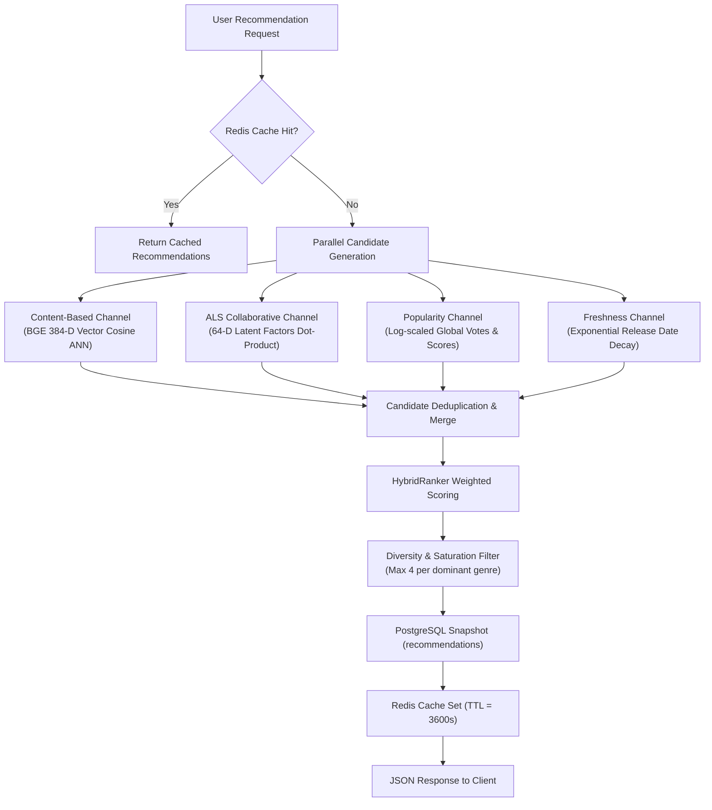
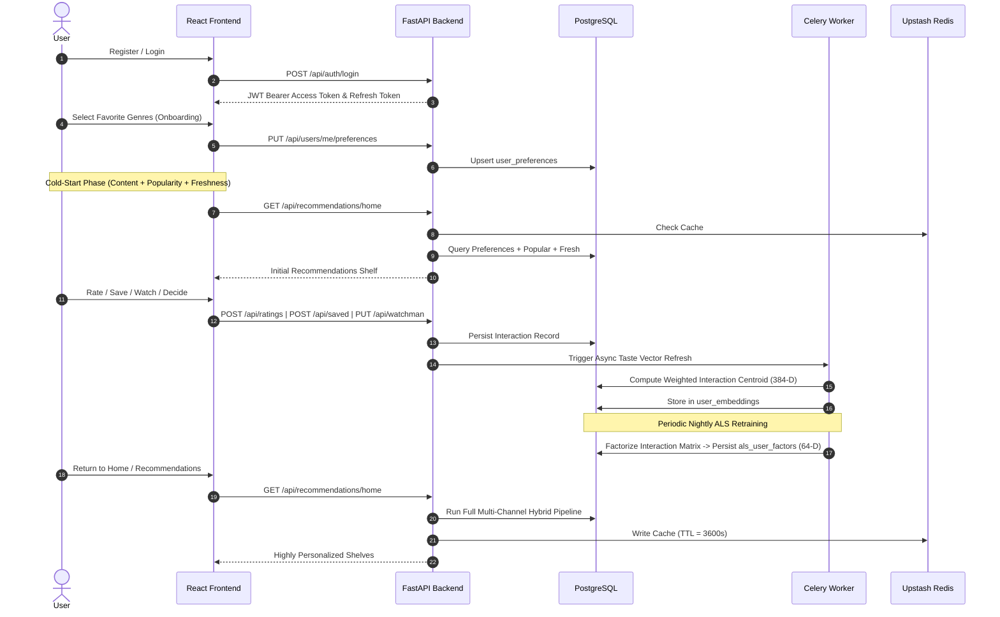

# WatchMan - Product Description & Capabilities

## 1. Product Overview

**WatchMan** is a modern, full-stack movie and TV/web-series discovery and personalized recommendation platform.

### The Problem WatchMan Solves
In an era of fragmented streaming platforms, viewers spend excessive time searching across disparate catalogs to find content that matches their exact taste. Generic popularity rails fail to capture personal nuance, and simple genre tags miss thematic depth and collective community affinities.

WatchMan solves discovery fatigue by providing a centralized, high-performance catalog search and exploration experience powered by a dual-engine hybrid recommendation system:
- **Semantic Content Understanding**: Dense 384-dimensional vector embeddings capturing plots, creative teams, and narrative themes.
- **Behavioral Collaborative Intelligence**: 64-dimensional latent factor matrix factorization learning cross-genre affinities from community consumption patterns.

### Product Scope & Boundaries
> [!IMPORTANT]
> **Discovery & Recommendation Platform, NOT a Streaming Service**:
> - WatchMan is strictly a **discovery, exploration, and recommendation platform**.
> - WatchMan **does NOT stream or host full-length movie or television playback**.
> - WatchMan integrates with external content and metadata providers (TMDB, OMDb, JustWatch) to surface official trailers, high-resolution artwork, external critical reception (IMDb, Rotten Tomatoes, Metacritic), and legitimate regional streaming availability links (*Where to Watch*).

---

## 2. Core Product Capabilities

The following capabilities are implemented and operational in WatchMan:

1. **Movie & TV Discovery**:
   - Multi-rail homepage showcases featuring *Trending Now*, *Top Rated Worldwide*, *Movies*, and *Web Series*.
   - Filterable catalog browsing by release year, genre, and spoken language.
   - Dedicated finite collections (e.g., top-100 popular titles paginated across 6 pages of 18 items).

2. **Unified Full-Text & Multi-Type Search**:
   - Universal search across movies and web series with title and overview matching.
   - Real-time fallback to TMDB multi-search when local catalog items yield 0 matches.

3. **Deep Content Details**:
   - Full narrative overviews, taglines, runtimes, episode/season counts, release dates, and production statuses.
   - Normalized genre taxonomy and spoken language localization.
   - Explicitly billed cast members with character roles and profile photos.
   - Directed crew members (directors, writers, executive producers) by department.

4. **Media & External Providers**:
   - Embedded official YouTube trailers, teasers, and promotional clips.
   - Image galleries featuring backdrops and promotional posters.
   - External identifiers linking directly to IMDb and Wikidata.
   - Region-specific *Watch Providers* (powered by JustWatch data via TMDB) showing flat-rate stream, rent, and buy options.

5. **User Authentication & Identity**:
   - Stateless JSON Web Token (JWT) registration and login.
   - Profile management with custom avatars, display names, and usernames.
   - Explicit genre onboarding preferences (favorited and disliked genres).

6. **Interactive Feedback & User Engagement**:
   - **Saved Content / Watchlist**: Bookmark movies and web series for future viewing.
   - **Ratings & Short Reviews**: 1–10 star ratings with optional personal reviews.
   - **Community Reviews**: Long-form written reviews visible to other platform users.
   - **Watch History & Progress Tracking**: Playback completion progress ($0.0 \dots 1.0$) and completion flags.
   - **WatchMan Decisions**: High-intent triage controls (*Must Watch*, *Time Pass*, or *Skip*).

7. **Personalized Recommendation Shelves**:
   - **You Must Like**: Top hybrid recommendations with explainable attribution tags.
   - **You Already Watched & Liked**: Rediscoveries based on completed high-sentiment titles.
   - **Continue Watching**: Real-time shelf displaying in-progress playback titles.
   - **Similar Titles**: On-page item-to-item similarity powered by `pgvector` cosine similarity.

8. **Sub-Second Recommendation Delivery**:
   - Tiered caching via Upstash Redis (1-hour TTL on recommendation feeds).
   - Snapshot persistence in PostgreSQL (`recommendations` table) guaranteeing deterministic retrieval.

---

## 3. Personalization Engine

WatchMan employs a multi-channel recommendation architecture that blends semantic content representation with behavioral collaborative filtering:



### Representation Independence
- **Content-Based Space (384-D)**: Dense semantic vectors computed via `BAAI/bge-small-en-v1.5` over synopses, genres, cast, and crew. Stored in `content_embeddings` and queried via `pgvector` cosine similarity against the user's centroid vector in `user_embeddings`.
- **Collaborative Space (64-D)**: Latent user ($\mathbf{u}_u$) and item ($\mathbf{v}_i$) factors learned via implicit-feedback Alternating Least Squares (ALS) matrix factorization over historical user interactions. Stored in `als_user_factors` and `als_item_factors`.
- **Zero Space Leakage**: The 384-D content space and 64-D ALS factor space are distinct mathematical representations. They are never concatenated or projected together; blending occurs solely at score fusion time inside `HybridRanker`.

### Production HybridRanker Formula
$$\text{Score} = 0.35 \times \text{Content} + 0.25 \times \text{ALS} + 0.15 \times \text{Popularity} + 0.15 \times \text{Freshness} + 0.10 \times \text{Preference}$$

- **Content Weight ($0.35$)**: Cosine similarity between user taste vector and candidate content vector.
- **ALS Weight ($0.25$)**: Min-max normalized dot product of user and item latent factors.
- **Popularity Weight ($0.15$)**: Normalized logarithmic scale of total vote counts and rating averages.
- **Freshness Weight ($0.15$)**: Exponential decay score favoring recent catalog releases.
- **Preference Match ($0.10$)**: Direct genre alignment boost based on the user's explicit profile preferences.

---

## 4. End-to-End Product Flow

```
1. User Browses / Searches
   └── Interacts with UI cards, applies genre/language filters, or searches titles.

2. User Interacts
   └── Submits a Rating, adds to Watchlist, updates Watch Progress, or logs a WatchMan Decision.

3. Database Persistence
   └── Immediate atomic write to PostgreSQL interaction tables (ratings, saved_content, watch_history, watchman_decisions).

4. Background ML Processing
   ├── content_based_worker (queue: content_based): Updates 384-D taste vector in user_embeddings.
   └── als_worker (queue: als): Retrains 64-D latent factors and updates als_user_factors / als_item_factors.

5. Next Recommendation Request
   ├── FastAPI queries CandidatePipeline across Content, ALS, Popularity, and Freshness channels.
   ├── Seen items (rated, saved, completed, skipped) are filtered out.
   ├── HybridRanker applies scoring and genre diversity balancing.
   └── Final recommendations are cached in Redis and persisted in recommendations table.

6. UI Delivery
   └── React renders personalized shelves ("You Must Like", "You Already Watched & Liked", "Continue Watching").
```

---

## 5. User Lifecycle



---

## 6. Cold-Start Handling

WatchMan handles new users and newly cataloged items without pipeline degradation or latency spikes:

1. **New Users (Zero Interactions)**:
   - The ALS candidate generator detects missing factors in `als_user_factors` and returns `[]` in $<1$ ms without blocking.
   - The recommendation pipeline uses **Popularity** and **Freshness** candidates, with `HybridRanker` applying preference matching if onboarding `UserPreference` is available. If onboarding preferences are unavailable, popularity and freshness provide valid initial recommendations rather than an empty list.
   - As the user begins interacting, the background worker flags their taste profile and incorporates them into the next training cycle.

2. **New Content Items (Zero Interactions)**:
   - Missing collaborative factors in `als_item_factors` are bypassed.
   - The item immediately participates in candidate retrieval via its **384-D BGE content embedding** and its **Freshness score boost**, preventing cold items from being hidden.

---

## 7. Cross-References

- **ALS Technical Details & Benchmarks**: [`docs/als-collaborative-filtering.md`](file:///c:/Users/13ver/Desktop/New%20folder/project/WatcheMan/docs/als-collaborative-filtering.md)
- **Content Filtering & Latency Architecture**: [`docs/content-filtering-and-performance.md`](file:///c:/Users/13ver/Desktop/New%20folder/project/WatcheMan/docs/content-filtering-and-performance.md)
- **API Reference**: [`docs/api-design.md`](file:///c:/Users/13ver/Desktop/New%20folder/project/WatcheMan/docs/api-design.md)
- **Database Schema**: [`docs/database-schema.md`](file:///c:/Users/13ver/Desktop/New%20folder/project/WatcheMan/docs/database-schema.md)
