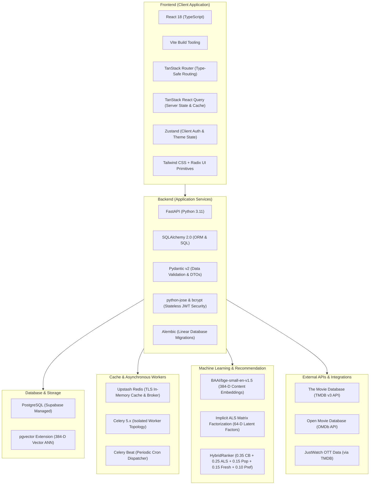

# WatchMan - Complete Technology Stack & Infrastructure Inventory

## 1. Technology Inventory by Layer

---

## 2. Frontend Layer

| Technology | Version / Spec | Purpose & Where Used |
| :--- | :--- | :--- |
| **React** | `18.3.x` | Core UI rendering engine for component tree. |
| **TypeScript** | `5.6.x` | Strict compile-time type safety across routes, DTOs, and API responses. |
| **Vite** | `5.4.x` | Modern ESM dev server and optimized production bundler. |
| **TanStack Router** | `1.58.x` | Type-safe file-based client router with strict search parameter validation. |
| **TanStack React Query** | `5.56.x` | Declarative server-state management, cache deduplication, and polling. |
| **Zustand** | `4.5.x` | Minimalist client state store for JWT sessions (`authStore`) and dark/light mode (`themeStore`). |
| **Tailwind CSS** | `3.4.x` | Utility-first CSS framework with custom brand colors and dark mode support. |
| **Radix UI Primitives** | `@radix-ui/*` | Unstyled, accessible UI components (`Dialog`, `DropdownMenu`, `Sheet`, `Tabs`, `Tooltip`, `Select`). |
| **Lucide React** | `0.441.x` | Clean SVG icon library. |
| **Sonner** | `1.5.x` | Toast notification manager for feedback and error alerts. |

---

## 3. Backend Layer

| Technology | Version / Spec | Purpose & Where Used |
| :--- | :--- | :--- |
| **Python** | `3.11` | High-performance asynchronous runtime. |
| **FastAPI** | `0.115.x` | Asynchronous web framework powering all REST endpoints (`/api/...`). |
| **Uvicorn** | `0.30.x` | Lightning-fast ASGI production web server. |
| **SQLAlchemy** | `2.0.x` | SQL toolkit and Object-Relational Mapper (ORM) using mapped column syntax. |
| **Pydantic** | `2.8.x` | High-speed data parsing and schema validation using Rust core (`pydantic-core`). |
| **Alembic** | `1.13.x` | Linear database migration engine tracking schema revisions. |
| **python-jose & bcrypt** | `3.3.x / 4.1.x` | Cryptographic JWT signing (HS256) and password hashing. |
| **httpx** | `0.27.x` | Async HTTP client for outbound communication with TMDB and OMDb. |

---

## 4. Database & Storage Layer

| Technology | Spec / Engine | Purpose & Where Used |
| :--- | :--- | :--- |
| **PostgreSQL** | `15+` (Supabase) | Primary relational database storing catalog, users, ratings, history, and factors. |
| **pgvector** | `vector` extension | Native vector similarity search executing cosine distance queries over 384-D BGE embeddings. |

---

## 5. Caching & Background Task Infrastructure

| Technology | Version / Spec | Purpose & Where Used |
| :--- | :--- | :--- |
| **Upstash Redis** | Serverless Redis (TLS `rediss://`) | Response cache (1-hour recommendation TTL, 24-hour OMDb TTL) and Celery message broker. |
| **Celery** | `5.4.x` | Distributed asynchronous task execution framework with queue isolation. |
| **Celery Beat** | `5.4.x` | Periodic scheduler dispatching cron triggers for user embeddings, ALS, and TMDB sync. |

---

## 6. Machine Learning & Recommendation Systems

| Component | Specification | Description & Role |
| :--- | :--- | :--- |
| **Content Embeddings** | `BAAI/bge-small-en-v1.5` (384-D) | Semantic dense text embeddings computed from title, plot, genres, and cast/crew. |
| **Collaborative Filtering** | Implicit ALS Matrix Factorization (64-D) | Behavioral latent factor model factorizing sparse user-item interaction matrices. |
| **Candidate Retrieval** | `CandidatePipeline` | 4-channel parallel candidate retrieval (Content-Based, ALS Collaborative, Popularity, Freshness). |
| **Hybrid Ranking** | `HybridRanker` | Multi-objective scoring blending signals with strict genre diversity saturation guards. |

---

## 7. External Third-Party APIs

| Service | Protocol / Auth | Data Provided |
| :--- | :--- | :--- |
| **The Movie Database (TMDB)** | REST API v3 (Bearer API Key) | Catalog metadata, synopsis, cast/crew billing, official trailers, backdrops, and JustWatch OTT data. |
| **Open Movie Database (OMDb)** | REST API (Query API Key) | External critical ratings (IMDb rating & votes, Rotten Tomatoes score, Metacritic rating). |
| **Hugging Face Inference API** | REST API (Bearer Token) | Fallback inference provider for `BAAI/bge-small-en-v1.5` embedding generation. |

---

## 8. Container & Deployment Topology

| Container Service | Base Image | Role & Responsibilities |
| :--- | :--- | :--- |
| `watchman_frontend` | `node:20-alpine` | SSR / Static production client serving on port `3000`. |
| `watchman_backend` | `python:3.11-slim` | FastAPI REST API container serving on port `8000`. |
| `watchman_content_based_worker` | `python:3.11-slim` | Dedicated worker listening to queue `content_based` (BGE embeddings & content recs). |
| `watchman_als_worker` | `python:3.11-slim` | Dedicated worker listening to queue `als` (Implicit ALS matrix factorization). |
| `watchman_celery_worker` | `python:3.11-slim` | General task worker listening to queues `default,celery` (TMDB ingest & cleanup). |
| `watchman_celery_beat` | `python:3.11-slim` | Celery Beat periodic cron scheduler. |
