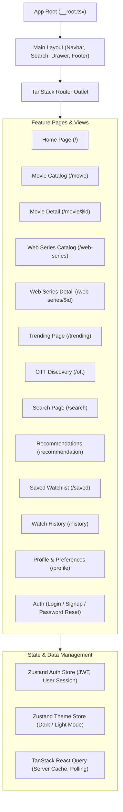

# WatchMan - UI/UX Architecture & User Flow Design

## 1. UI Architecture

WatchMan's frontend is a Single Page Application (SPA) built with React 18, TypeScript, Vite, TanStack Router, TanStack React Query, Tailwind CSS, and Radix UI / shadcn component primitives:



### Technology Breakdown
- **Framework & Language**: React 18 with strict TypeScript (`strict: true`).
- **Routing**: TanStack Router (file-based routing with full type-safe parameter validation).
- **Server State & Caching**: TanStack React Query (`@tanstack/react-query`) with automatic background refetching and cache invalidation.
- **Client State**: Zustand (`useAuthStore`, `useThemeStore`) with persistent local storage syncing.
- **UI Components & Styling**: Tailwind CSS, Lucide React icons, Sonner toast notifications, and Radix UI accessible primitives (`Dialog`, `Sheet`, `DropdownMenu`, `Tabs`, `Tooltip`, `Select`, `ScrollArea`).

---

## 2. Information Architecture & Navigation

The primary navigation bar is anchored at the top of the viewport with responsive collapses:

```
[ WatchMan Logo ]  Movies  Web Series  Trending  OTT Discovery  AI Recommendations  |  [ Search Input ]  [ Saved Watchlist ]  [ User Avatar Menu ]
```

### Global Navigation Hierarchy:
- **Home (`/`)**: Hero showcase banner, personalized shelves (*You Must Like*, *Watched & Liked*, *Continue Watching*), and global rails.
- **Movies (`/movie`)**: Grid browsing with release year, genre, and spoken language filters.
- **Web Series (`/web-series`)**: Dedicated episodic television catalog with season and episode badges.
- **Trending (`/trending`)**: Aggregated weekly and daily popular showcases.
- **OTT Discovery (`/ott`)**: Filter titles by regional streaming provider (Netflix, Prime Video, Disney+ Hotstar, JioCinema, Apple TV+).
- **Search (`/search`)**: Real-time unified search across movies and web series.
- **Recommendations (`/recommendation`)**: Full-page view of personalized candidate recommendations.
- **Saved Watchlist (`/saved`)**: Personal library of bookmarked content.
- **Watch History (`/history`)**: Playback tracking and resume watching management.
- **User Profile (`/profile`)**: Preference settings and favorite/disliked genre management.

---

## 3. Core User Flows

### Flow 1: Authentication & Onboarding
```
1. User clicks "Sign In" or "Sign Up".
2. Submits email and password on `/login` or `/signup`.
3. Backend issues JWT access and refresh tokens.
4. Tokens are stored in Zustand (`authStore`) and attached to subsequent API requests.
5. First-time users navigate to `/profile` to select favorite and disliked genres.
```

### Flow 2: Catalog Discovery & Multi-Attribute Filtering
```
1. User navigates to `/movie` or `/web-series`.
2. Applies filters: Genre (e.g. Science Fiction), Spoken Language (e.g. English), Release Year (e.g. 2024), and Sort (e.g. Popularity Descending).
3. React Query issues `GET /api/movies?page=1&limit=18&genre_id=878&year=2024`.
4. Fast grid pagination renders with 18 items per page without client-side lag.
```

### Flow 3: Content Inspection & Media Playback
```
1. User clicks a title card (navigates to `/movie/$id` or `/web-series/$id`).
2. Deep details load: synopsis, tagline, runtime, cast with character roles, directed crew, and IMDb / Rotten Tomatoes / Metacritic scores.
3. User clicks "Watch Trailer" -> opens `VideoModal` embedding official YouTube player.
4. "Where to Watch" section surfaces active regional streaming providers.
```

### Flow 4: Interactive Rating & WatchMan Decisions
```
1. On the detail view, user clicks "Rate Title" -> opens `RatingModal`.
2. Selects 1–10 stars and inputs an optional review.
3. Submits rating -> calls `POST /api/ratings` and invalidates React Query recommendation cache.
4. User selects a WatchMan Decision: [Must Watch] | [Time Pass] | [Skip].
5. Calls `PUT /api/content/{id}/watchman` -> instantly recalculates dynamic community score (0–100) and displays badge.
```

---

## 4. Personalized Recommendation UI Components

### 1. `PersonalizedShelf` (Homepage Shelves)
Rendered on the homepage only when authenticated users have active interaction history:
- **You Must Like**: Displays top recommendations derived from `GET /api/recommendations/must-like` with explainable attribution badges (e.g. *"Learned from the behaviour of users with similar taste"*).
- **You Already Watched & Liked**: Displays rediscovery titles from `GET /api/recommendations/watched-liked`.
- **Continue Watching**: Real-time resume-playback shelf from `GET /api/recommendations/continue-watching` with visual progress bars.
- **Defensive Deduplication**: Items appearing in *Continue Watching* are automatically suppressed from *Watched & Liked* and *Must Like*.

### 2. `WatchmanScoreCard`
A prominent UI widget rendered on detail pages showing:
- **Dynamic Score Ring**: Large circular gauge displaying the 0–100 calculated score.
- **Classification Badge**: Green (*Must Watch*), Yellow (*Time Pass*), or Red (*Skip*).
- **Community Breakdown Bar**: Percentage breakdown of community sentiment.
- **Interactive Action Buttons**: Direct toggle controls for the user's personal classification.

---

## 5. UI States & Defensive UX

1. **Loading Skeletons (`components/Skeletons.tsx`)**:
   - `HeroSkeleton`: Shimmering placeholder for hero banners.
   - `CardSkeleton`: Uniform poster card placeholder with aspect ratio $2:3$.
   - `ShelfSkeleton`: Horizontal scrolling placeholder rail.
2. **Empty States (`components/States.tsx`)**:
   - `SearchEmptyState`: Renders clean graphic with search tips when queries yield zero matches.
   - `SavedEmptyState`: Displays a call-to-action to explore the catalog when watchlist is empty.
3. **Error Handling (`components/States.tsx`)**:
   - `ErrorState`: Friendly error message with an actionable "Try Again" retry button.
   - Individual homepage rails fail gracefully: if one rail encounters a network glitch, other rails continue rendering normally.
4. **Authentication Gates**:
   - Protected features (rating, saving, personalized recommendations) prompt an unauthenticated modal with quick login links.

---

## 6. Responsive Design & Accessibility

- **Breakpoints**: Fully optimized for mobile ($<640\text{px}$), tablet ($640\text{px} \dots 1024\text{px}$), and desktop ($>1024\text{px}$).
- **Mobile Drawer**: Slide-over navigation drawer (`Sheet`) for mobile screens.
- **Accessible ARIA Standards**: All modals and dialogs use Radix UI primitives with focus trapping, `aria-hidden` decorative icons, and explicit screen reader labels.
